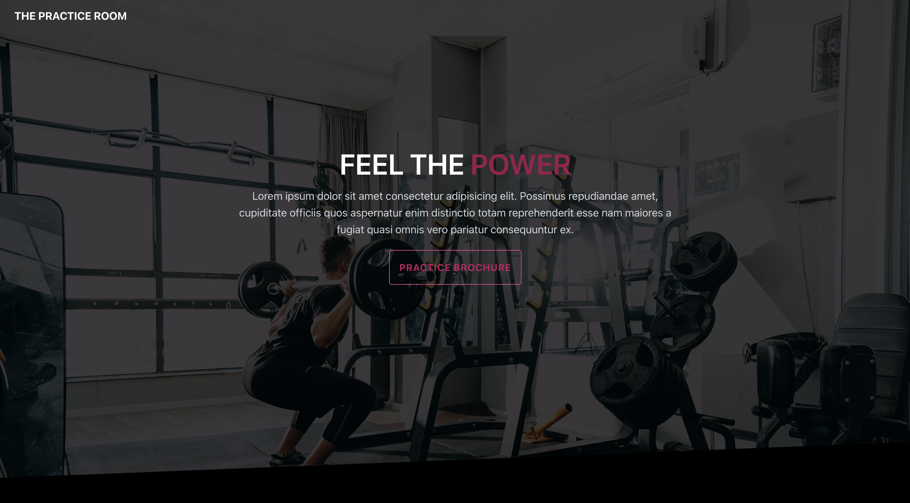
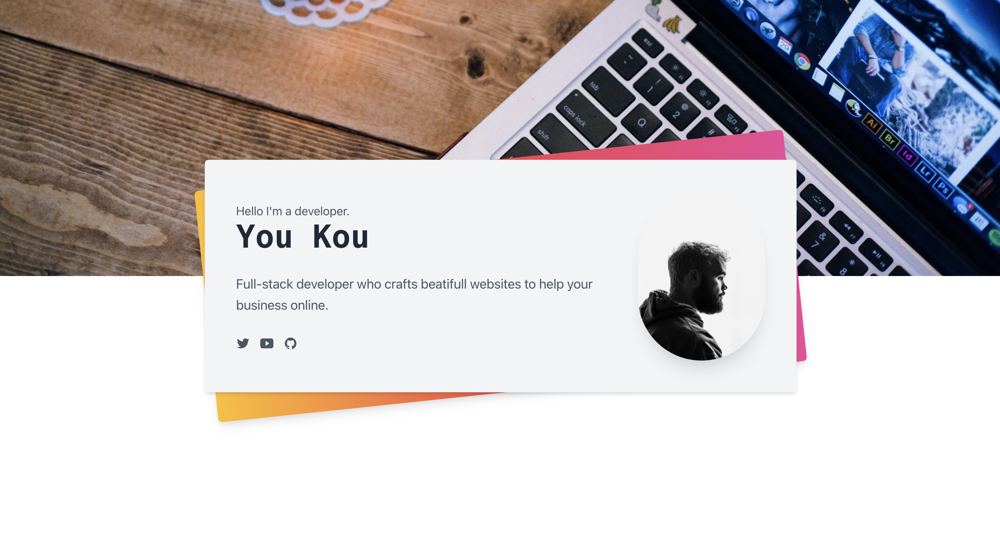
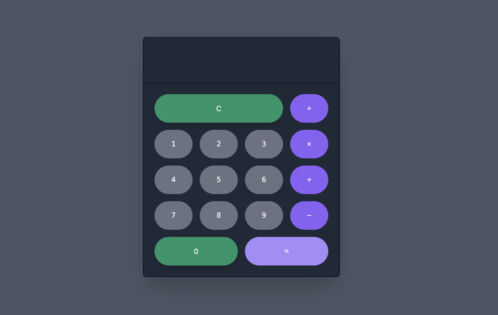
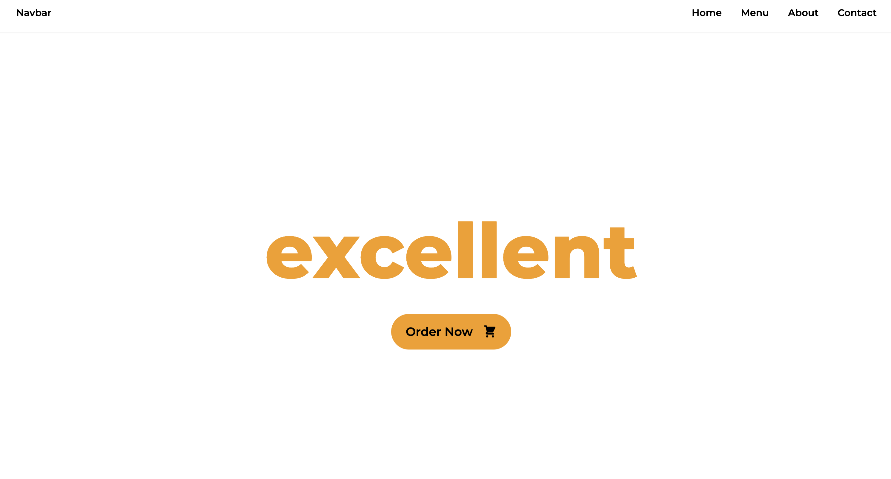
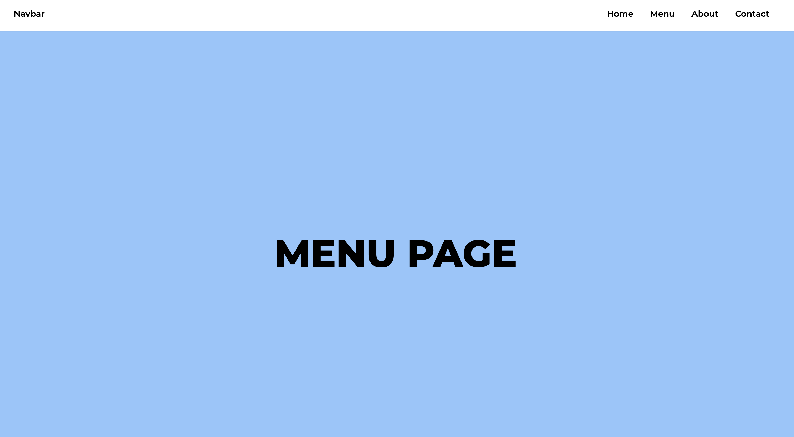
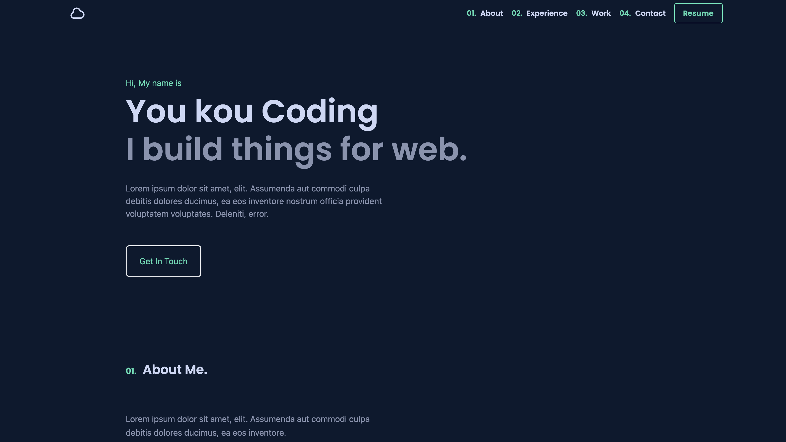
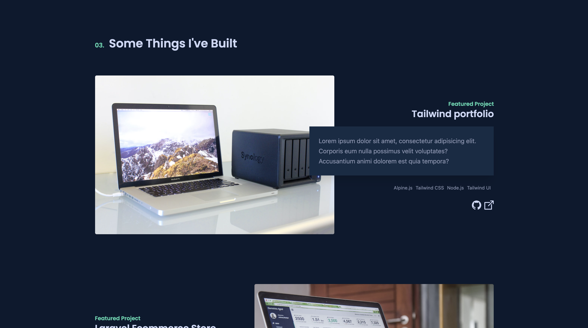

# tailwindcss-demo

## Demo3 -- deployed on AWS S3

[Demo-3 on AWS S3](http://tailwindcss-demo-3.s3-website-ap-northeast-1.amazonaws.com/)

---

## Demo4 -- deployed on AWS S3

[Demo4 on AWS S3](http://tailwindcss-demo-4.s3-website-ap-northeast-1.amazonaws.com)

---

## Demo5 -- deployed on AWS S3

[Demo5 on AWS S3](http://tailwindcss-demo-5.s3-website-ap-northeast-1.amazonaws.com)

---

## Demo7 -- deployed on AWS S3

[Demo7 on AWS S3](http://tailwindcss-demo-7.s3-website-ap-northeast-1.amazonaws.com)

---

## Demo9 -- deployed on AWS S3

[Demo9 on AWS S3](http://tailwindcss-demo-9.s3-website-ap-northeast-1.amazonaws.com)

---

## Demo10 -- deployed on AWS S3

[Demo10 on AWS S3](http://tailwindcss-demo-10.s3-website-ap-northeast-1.amazonaws.com)
